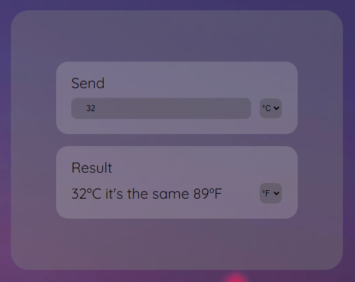
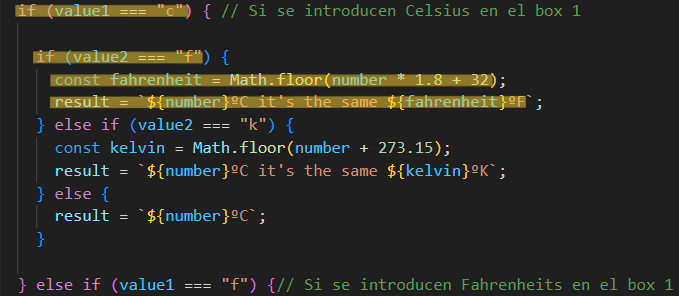

# 🌡️ Conversor de temperatira 🌡️

## 📜 Sobre el proyecto 

Este proyecto contiene una función en JavaScript para convertir temperaturas entre grados Celsius, Fahrenheit y Kelvin. La interfaz es sencilla y permite al usuario introducir un valor de temperatura en un campo y seleccionar la unidad de conversión.

## 🛠️ Stack 

   

## 📋 Descripción de función 

La función convertTemperature() convierte la temperatura introducida por el usuario entre las unidades Celsius, Fahrenheit y Kelvin. La función se activa automáticamente cuando se cambia el valor en el campo de entrada o en cualquiera de los selectores.

## ⚙️ Funcionamiento 

El usuario ingresa un valor numérico en el campo de texto.
Selecciona la unidad de origen y la unidad de destino.
La conversión se realiza automáticamente al seleccionar la unidad o ingresar el número.

1. El usuario ingresa un valor numérico en el campo de texto.
2. Selecciona la unidad de origen y la unidad de destino.
3. La conversión se realiza automáticamente al seleccionar la unidad o ingresar el número.

## 🌡️ Ejemplo de Conversión de temperatura 

Si se selecciona Celsius como unidad de origen y Fahrenheit como unidad de destino, la función calcula el equivalente en Fahrenheit utilizando la fórmula de conversión.

### 🧮 Fórmulas de Conversión 

- De Celsius a Fahrenheit: F=(C×1.8)+32
code: const fahrenheit = Math.floor(number * 1.8 + 32);

- De Celsius a Kelvin: K=C+273.15
code: code: const kelvin = Math.floor(number + 273.15);

- De Fahrenheit a Celsius: C=(F−32)/1.8
code: const celsius = Math.floor((number - 32) / 1.8);

- De Fahrenheit a Kelvin: K=((F−32)×5/9)+273.15
code: const kelvin = Math.floor(((number - 32) * 5) / 9 + 273.15);

- De Kelvin a Celsius: 𝐶=𝐾−273.15C=K−273.15
code: const celsius = Math.floor(number - 273.15);

- De Kelvin a Fahrenheit: 𝐹=((𝐾−273.15)×9/5)+32
code: const fahrenheit = Math.floor(((number - 273.15) * 9) / 5 + 32);

## 💻 ¿Quieres comprobar esta función? 

- [Visita el Conversor de Temperatura](https://abrahamgalvezv.github.io/Temperature_converter/)
- Clona este repositorio en tu equipo y comprueba cómo está creado
- Implementa esta función en tu proyecto 

## 📭 Contacto 

 

